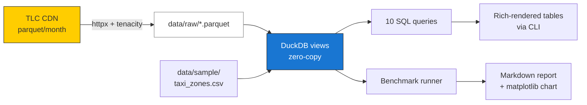
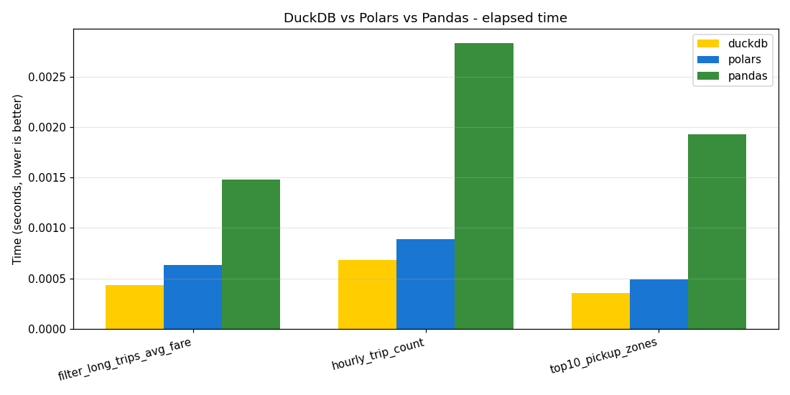

# NYC Taxi Analytics

> High-performance SQL analytics on NYC TLC Yellow Taxi parquet files using **DuckDB** — no warehouse needed.

[](https://github.com/wxssxm/nyc-taxi-analytics/actions/workflows/ci.yml)
[](https://www.python.org/)
[](LICENSE)
[](docker/Dockerfile)
[](#testing)

NYC TLC publishes ~30M taxi trips per month as Parquet. This project queries them directly with DuckDB — no ingestion, no warehouse, no orchestrator. Ten analytical questions, three engines benchmarked, one CLI.

## Architecture



The download layer is idempotent (HEAD request compares Content-Length before re-fetching). The analytics layer registers DuckDB views over a Parquet glob — no copies, no inserts. The benchmark layer runs the same logical query through DuckDB SQL, Polars LazyFrames, and Pandas DataFrames and reports best-of-N timings.

## Stack

| Layer | Technology |
| --- | --- |
| Storage | Parquet (zstd, partition-per-month) |
| Query engine | [DuckDB](https://duckdb.org) 1.1+ (primary), [Polars](https://pola.rs) 1.10+, Pandas 2.2+ (benchmarks) |
| HTTP | [httpx](https://www.python-httpx.org/) + [tenacity](https://tenacity.readthedocs.io/) retries |
| CLI | [Typer](https://typer.tiangolo.com/) + [Rich](https://rich.readthedocs.io/) |
| Config | [pydantic-settings](https://docs.pydantic.dev/latest/concepts/pydantic_settings/) |
| Logging | [loguru](https://loguru.readthedocs.io/) |
| Tests | pytest + [respx](https://lundberg.github.io/respx/) (HTTP mocking) |
| Lint / format | ruff + black, pre-commit hooks |
| CI / packaging | GitHub Actions, Docker multi-stage, [uv](https://docs.astral.sh/uv/) |

## Quickstart

```bash
git clone https://github.com/wxssxm/nyc-taxi-analytics.git
cd nyc-taxi-analytics
cp .env.example .env

# Local install (uv handles Python 3.11)
make install

# Download Jan-Mar 2024 (~150 MB), run all 10 queries, run benchmarks
make run
```

Or with Docker:

```bash
make docker-up
# runs the container with `query all` against bundled sample data
```

The repo ships a 261 KB synthetic Yellow Taxi parquet (`data/sample/yellow_tripdata_2024-01.parquet`) so every command works out of the box without downloading the real data — useful for CI and quick demos.

## CLI

```bash
nyc-taxi --help                           # discover commands
nyc-taxi download --start 2024-01 --end 2024-03   # fetch parquet
nyc-taxi query top-zones                  # one of 10 named queries
nyc-taxi query all                        # run them all
nyc-taxi benchmark --repeats 5            # DuckDB vs Polars vs Pandas
nyc-taxi pipeline                         # full sequence
```

## Query showcase

The 10 queries are named (CLI-callable) and live in [`src/nyc_taxi/analytics/queries.py`](src/nyc_taxi/analytics/queries.py):

| Name | What it answers |
| --- | --- |
| `top-zones` | Top pickup zones by trip count, with revenue |
| `hourly-revenue` | Trip volume and revenue by hour of day |
| `tip-patterns` | Average tip % by payment method |
| `duration-percentiles` | p50 / p75 / p90 / p99 trip duration in minutes |
| `fare-per-mile` | $/mile by hour — efficiency proxy |
| `weekend-vs-weekday` | Volume, fare, tip comparison |
| `fraud-heuristics` | Counts of suspicious trips (negative fare, > 100 mi, > 6h, etc.) |
| `top-routes` | Most common pickup → dropoff zone pairs |
| `daily-trend` | Daily trip count and revenue |
| `passenger-distribution` | Solo vs group trips |

Example — `nyc-taxi query top-zones`:

```
                  top-zones - Top pickup zones by trip count
┏━━━━━━━━━━━━━━━┳━━━━━━━━━━━━━━━━━━┳━━━━━━━━━━━━┳━━━━━━━━━━━━━━┳━━━━━━━━━━━━━━━━━━┓
┃ borough       ┃ zone             ┃ trip_count ┃ avg_fare_usd ┃ total_revenue_usd ┃
┡━━━━━━━━━━━━━━━╇━━━━━━━━━━━━━━━━━━╇━━━━━━━━━━━━╇━━━━━━━━━━━━━━╇━━━━━━━━━━━━━━━━━━┩
│ Manhattan     │ Governor's Isl.  │ 106        │ 19.48        │ 2064.0            │
│ Queens        │ Corona           │ 92         │ 19.42        │ 1787.0            │
│ Staten Island │ Bloomfield       │ 63         │ 19.51        │ 1229.0            │
│ Bronx         │ Schuylerville    │ 56         │ 19.73        │ 1105.0            │
│ Brooklyn      │ Marine Park      │ 56         │ 20.45        │ 1145.0            │
└───────────────┴──────────────────┴────────────┴──────────────┴───────────────────┘
```

## Benchmarks: DuckDB vs Polars vs Pandas

Three identical workloads, expressed in each engine's idiomatic API, best-of-3 timing, run on the bundled 10k-row sample:

| Workload | DuckDB | Polars | Pandas | Speedup vs Pandas |
| --- | ---: | ---: | ---: | ---: |
| `hourly_trip_count` | 0.001s | 0.001s | 0.003s | 4.2× |
| `top10_pickup_zones` | 0.000s | 0.000s | 0.002s | 5.4× |
| `filter_long_trips_avg_fare` | 0.000s | 0.001s | 0.001s | 3.4× |



The differences widen sharply as data grows: Pandas loads everything into Python objects, while DuckDB and Polars push down predicates and parallelise across CPU cores. Run `nyc-taxi benchmark` against real Jan-Mar 2024 data (~10M rows, ~150 MB) to see DuckDB pull ahead by 1-2 orders of magnitude.

The benchmark code is in [`src/nyc_taxi/benchmarks/compare.py`](src/nyc_taxi/benchmarks/compare.py); each engine implementation is a few lines and easy to audit for fairness.

## Project structure

```
nyc-taxi-analytics/
├── src/nyc_taxi/
│   ├── ingestion/download.py    # httpx + tenacity, idempotent
│   ├── analytics/
│   │   ├── database.py          # DuckDB connection + view registration
│   │   └── queries.py           # 10 SQL queries
│   ├── benchmarks/compare.py    # DuckDB vs Polars vs Pandas
│   ├── cli.py                   # Typer + Rich CLI
│   ├── pipeline.py              # `python -m` entry point
│   └── config.py                # pydantic-settings
├── tests/
│   ├── unit/                    # 35 unit tests (incl. respx HTTP mocks)
│   └── integration/             # 6 end-to-end tests on sample data
├── data/sample/                 # bundled mini-parquet + taxi zones CSV
├── scripts/generate_sample_data.py
├── docker/Dockerfile            # multi-stage slim
├── docker-compose.yml
├── .github/workflows/ci.yml     # lint, test on 3.11 & 3.12, docker build
├── Makefile
└── pyproject.toml
```

## Testing

```bash
make test          # all 41 tests + coverage report (target: ≥ 70%)
make test-unit     # skip integration tests
make lint          # ruff + black checks
make format        # auto-fix
```

Coverage is currently **87%** across the source modules. Tests use:
- **respx** to mock the TLC CDN for download tests (no network needed in CI)
- A bundled 10k-row synthetic parquet matching the real TLC 2024 schema
- Full end-to-end run of the 10 queries and 3 benchmarks against that sample

## Why no orchestrator?

This project deliberately omits Airflow/Prefect/Dagster. The point is to demonstrate that for many analytical workloads, a few well-chosen Parquet files plus DuckDB *is* the entire pipeline. Orchestration is an answer to scale; this project is an answer to "how much can you do without it?". For a project that *does* embrace orchestration, see [hacker-news-data-lake](https://github.com/wxssxm/hacker-news-data-lake) (Airflow) in the same portfolio.

## Roadmap

- [ ] Add Green and FHV taxi types side-by-side (schemas differ)
- [ ] Persist query results to a DuckDB file for incremental analysis
- [ ] S3-backed parquet glob (works in DuckDB out of the box, just needs config)
- [ ] Streamlit page for the daily-trend and hourly-revenue queries
- [ ] Memory benchmarks via `psutil` RSS sampling
- [ ] Generate query results into a static HTML report (auto-published via GitHub Pages)

## License

MIT — see [LICENSE](LICENSE).

## Author

**Wassim Fayala** — Data Engineer apprenti @ La Forge (Paris)

[LinkedIn](https://www.linkedin.com/in/wassim-fayala/) · wassimfayala2@gmail.com
